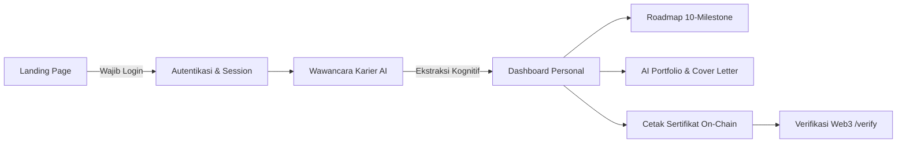

# NeuroPath — Digital AI Career Counseling Platform

> **Solusi Bimbingan Konseling (BK) Karier Digital Berbasis AI & Kognitif untuk Siswa SMA/SMK Indonesia**

[](https://nextjs.org/)
[](https://react.dev/)
[](https://firebase.google.com/)
[](https://groq.com/)
[](https://sepolia.etherscan.io/)
[](https://neuropath-rho.vercel.app)

---

## 🌐 Live Demo & Akses Cepat Juri

Juri dapat langsung menguji versi produksi yang sedang aktif tanpa perlu menginstal aplikasi secara lokal:

🔗 **Tautan Produksi**: [https://neuropath-rho.vercel.app](https://neuropath-rho.vercel.app)  
📦 **Repositori GitHub**: [https://github.com/GlorysID/NeuroPath](https://github.com/GlorysID/NeuroPath)  
📜 **Verifikasi Kredensial On-Chain**: [https://neuropath-rho.vercel.app/verify](https://neuropath-rho.vercel.app/verify)

---

## 🚀 Panduan Instalasi Lokal (Hanya 3 Langkah)

Proyek ini telah dikonfigurasi dengan toleransi dependensi otomatis (`.npmrc`) dan konfigurasi Firebase siap pakai di `src/lib/firebase.js`.

### Prasyarat
- **Node.js**: Versi 20.x atau lebih baru (`node -v`)
- **NPM**: Versi 10.x atau lebih baru (`npm -v`)

---

### Langkah 1: Pasang Dependensi
Buka terminal di dalam folder proyek dan jalankan:
```bash
npm install
```
*(File `.npmrc` telah menyertakan `legacy-peer-deps=true` untuk menjamin kompatibilitas React 19 tanpa konflik).*

---

### Langkah 2: Siapkan File Lingkungan (.env.local)
Salin template konfigurasi:
```bash
# Untuk Windows (Command Prompt / PowerShell):
copy .env.local.example .env.local

# Untuk Linux / macOS:
cp .env.local.example .env.local
```

Buka `.env.local` dan masukkan kunci API Groq Anda:
```env
GROQ_API_KEY=gsk_your_groq_api_key_here
AI_MODEL=openai/gpt-oss-120b
```
> 💡 *Dapatkan API Key Groq gratis dalam 1 menit di [console.groq.com/keys](https://console.groq.com/keys).*  
> **Catatan**: Kredensial Firebase Client sudah tertanam di `src/lib/firebase.js`, sehingga Anda **tidak perlu repot membuat project Firebase baru**. Autentikasi dan database langsung berjalan!

---

### Langkah 3: Jalankan Server Pengembangan
```bash
npm run dev
```
Buka browser Anda dan kunjungi: **[http://localhost:3000](http://localhost:3000)**

---

## 🧭 Panduan Alur Pengujian untuk Juri (Demo Flow)

Untuk mengevaluasi seluruh kapabilitas dan fitur unggulan NeuroPath, ikuti alur berikut:



1. **Halaman Utama (Landing Page) (`/`)**:
   - Tampilan antarmuka modern bernuansa editorial, 3D Canvas humanoid interaktif, pengalihan tema (Terang / Gelap), dan bilingual (Indonesia / Inggris).
   - Klik **"Mulai Wawancara AI"** atau **"Eksplorasi Fitur Dashboard"**. Sistem secara otomatis mendeteksi status sesi pengguna dan mengarahkan ke halaman Login jika belum masuk.

2. **Masuk / Registrasi (`/login`)**:
   - Masuk menggunakan Akun Google (Popup 1-klik) atau daftarkan akun email baru.
   - Sesi terenkripsi dan persisten ditangani oleh Firebase Auth.

3. **Sesi Wawancara Karier AI (`/interview`)**:
   - **Mode Suara (Hands-Free Voice)**: Bicara langsung dengan AI menggunakan Text-to-Speech otomatis dan Web Speech API.
   - **Mode Teks**: Ketik jawaban secara fleksibel jika mikrofon tidak tersedia.
   - AI mengajukan pertanyaan kontekstual bertahap, mengevaluasi minat, gaya berpikir, dan memetakan 6 dimensi kognitif siswa (Analytical, Creative, Strategic, Technical, Leadership, Social).

4. **Dashboard Siswa (`/dashboard`)**:
   - **Peta Kognitif (Radar Chart SVG)**: Visualisasi grafis hasil evaluasi dimensi kognitif siswa.
   - **Arketipe Karier Utama**: Penentuan profil dominan (contoh: *The Strategic Architect*, *Creative Visionary*).
   - **Live AI Agent Feed**: Analisis adaptif mengenai lintasan masa depan siswa.
   - **Generator Portfolio & Cover Letter**: Klik aksi cepat untuk membuat resume dan surat lamaran kerja terpersonalisasi via AI secara instan.
   - **Pencarian Terpadu (Unified Search)**: Pencarian cerdas lowongan kerja, jurnal BK, dan materi pembelajaran.

5. **Peta Jalan Karier / Roadmap (`/dashboard/roadmap`)**:
   - Pohon keahlian (*Skill Tree*) 10 pencapaian terstruktur dari level dasar hingga profesional.
   - Tiap milestone memuat modul belajar, studi kasus, dan target yang dapat diselesaikan siswa.

6. **Penerbitan & Verifikasi Sertifikat Blockchain (`/verify`)**:
   - Siswa yang menyelesaikan asesmen dapat mencetak sertifikat digital permanen berbasis smart contract ERC-721 di Ethereum Sepolia Testnet.
   - Sekolah, universitas, atau orang tua dapat memverifikasi keaslian sertifikat di rute `/verify` menggunakan Token ID atau Alamat Kontrak.

---

## 🏗️ Arsitektur Sistem & Inovasi Teknologi

- **Resilient AI Cascade**: Menggunakan router AI dengan model default ultra-cepat `openai/gpt-oss-120b` serta mekanisme fallback multi-tier (`qwen/qwen3.8-27b` -> `openai/gpt-oss-20b` -> `groq/compound`) dan *conversational fallback* yang mencegah terjadinya HTTP 500 error jika API eksternal mengalami kendala.
- **Low-Latency Long Polling Firestore**: Mengatasi anomali koneksi gRPC HTTP/2 Windows dengan konfigurasi `experimentalForceLongPolling: true`, menurunkan latensi sinkronisasi dari puluhan detik menjadi ~600ms.
- **Strict Session Guarding**: Route wawancara dan dashboard diproteksi dengan verifikasi status session (`onAuthStateChanged`). Pengguna tanpa session akan diarahkan ke halaman login dengan retensi tujuan akhir.
- **Smart Contract ERC-721 (Solidarity)**: Kontrak `NeuroPathCredential.sol` terintegrasi dengan Hardhat dan OpenZeppelin untuk menjamin bukti kelulusan yang tidak dapat dimanipulasi (*tamper-proof*).

---

## 📁 Struktur Berkas

```
NeuroPath/
├── contracts/               # Smart contract Solidity (ERC-721 Token)
│   └── NeuroPathCredential.sol
├── public/                  # Aset statis & 3D GLB Model (xbot.glb)
│   ├── images/
│   └── models/
├── scripts/                 # Skrip deployment kontrak & database
│   ├── deploy.js
│   └── upgrade_db.js
├── src/
│   ├── app/
│   │   ├── api/             # API routes (interview, extract, portfolio, verify, mint)
│   │   ├── components/      # Komponen UI (RadarChart, SkillTree, ThemeToggle, Model 3D)
│   │   ├── context/         # LanguageContext (ID/EN) & ThemeContext
│   │   ├── dashboard/       # Halaman Dashboard, Profile, & Roadmap
│   │   ├── interview/       # Halaman Wawancara AI 3D Voice/Text
│   │   ├── login/           # Halaman Login & Registrasi
│   │   ├── verify/          # Halaman Verifikasi Sertifikat On-Chain
│   │   ├── page.js          # Landing Page Utama
│   │   └── globals.css      # Desain sistem & tema CSS
│   └── lib/
│       ├── ai.js            # Engine LLM Groq & router fallback
│       ├── firebase.js      # Inisialisasi Firebase Auth & Firestore
│       └── jobService.js    # Integrasi pencarian lowongan kerja
├── .env.local.example       # Template variabel lingkungan
├── .npmrc                   # Konfigurasi toleransi dependensi NPM
├── hardhat.config.js        # Konfigurasi Hardhat Web3
├── package.json             # Manifest dependensi & skrip
└── README.md                # Dokumentasi utama proyek
```

---

## 📦 Skrip NPM yang Tersedia

| Perintah | Fungsi |
| :--- | :--- |
| `npm run dev` | Menjalankan server pengembangan lokal di port 3000 |
| `npm run build` | Melakukan kompilasi produksi Next.js dengan Turbopack |
| `npm run start` | Menjalankan bundle produksi yang telah di-build |
| `npm run lint` | Memeriksa kepatuhan kode menggunakan ESLint |
| `npx hardhat test` | Menjalankan pengujian unit smart contract blockchain |

---

## 👨‍💻 Tim Pengembang

- **Pengembang**: GlorysID ([anjalisaputra@gmail.com](mailto:anjalisaputra@gmail.com))
- **Institusi**: SMK Bina Mandiri Multimedia
- **Lisensi**: MIT License
